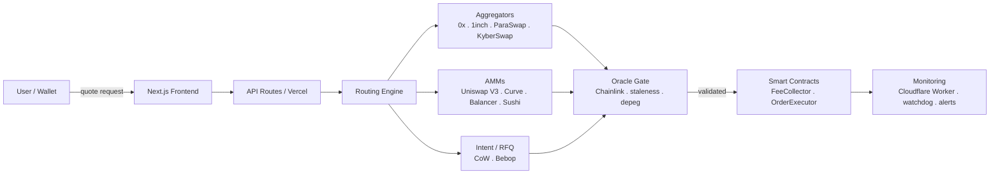

<h1 align="center">TeraSwap</h1>

  <strong>A security-first DEX meta-aggregator for Ethereum, Base &amp; Arbitrum.</strong> 
  Best-execution routing across 12 liquidity sources, on-chain conditional orders,
  MEV-protected settlement, and one-time approvals.

  
  
  
  
  

What is TeraSwap?

TeraSwap is a meta-aggregator: instead of routing through a single DEX or a single aggregator, it
queries many liquidity sources in parallel, validates every quote against independent price oracles, and
settles through the venue that gives the user the best net outcome after gas and fees. It runs on
Ethereum Mainnet, Base, and Arbitrum, and layers on order types and protections that most swap
interfaces don't offer.

The guiding principle is simple: a swap should never execute on bad data, and the user should always
see what they're signing.

Highlights

Best-execution routing across 12 integrated liquidity sources — aggregators (0x, 1inch,
ParaSwap/Velora, KyberSwap, OpenOcean, Odos), AMMs (Uniswap V3, Curve, Balancer, SushiSwap), and
intent/RFQ venues (CoW Protocol, Bebop).
On-chain conditional orders — executed autonomously by an audited on-chain
order engine and Chainlink-triggered keeper. DCA, Limit, Stop-Loss, and Take-Profit orders are **coming
soon**.
MEV protection — sensitive flow can settle through CoW Protocol's batch auctions to neutralise
sandwich and front-running risk.
One-time approvals via Permit2 — approve a token once on-chain, then authorise every swap after
with a signature instead of a separate approval transaction. No infinite approvals, ever.
Oracle-validated quotes — every swap is cross-checked against Chainlink feeds before it can execute
(29 feeds on Ethereum Mainnet alone, more on Base and Arbitrum). No single price source is ever
trusted on its own.
Clear signing (ERC-7730) — a Ledger-registry descriptor for human-readable swap details is prepared
and lint-clean; upstream registry submission is in progress.

Architecture

A request is priced across all sources, every candidate quote passes an oracle gate (Chainlink
validation, per-feed staleness, stablecoin depeg detection, and on L2 a sequencer-uptime check), and only
then is settlement built against whitelisted routers with an on-chain minimumOutput. An independent
monitoring stack watches contract and infra health continuously.

Security

Security is the core of the product, not an afterthought. Among the layers in place:

Mandatory oracle validation — Chainlink price checks gate every swap; large swaps are blocked when
secondary validation is unavailable.
Per-feed staleness & depeg breakers — stale feeds and stablecoin depegs halt affected routes.
L2 sequencer-uptime gate — quotes and swaps are blocked while a chain's sequencer is down.
Router whitelist + function-selector allowlist — settlement can only call vetted contracts and
vetted functions.
Recipient gating & on-chain minimumOutput — slippage and mis-delivery are enforced on-chain.
Timelocked governance — router changes pass through a queued, time-delayed execution path.
Supply-chain hardening — pinned dependencies, release-age delays, secret scanning, and
cryptographically signed commits on every branch.
Continuous monitoring — cron health ticks, an external watchdog, and a kill-switch.

Tech Stack

| Layer | Technologies |
|---|---|
| Frontend | Next.js 16, React 18, TypeScript 5.5, Tailwind CSS, Wagmi, Viem, RainbowKit, Zustand |
| Backend | Next.js API Routes (Vercel serverless), Upstash Redis, Supabase (PostgreSQL + RLS) |
| Contracts | Solidity 0.8.28, Foundry, Chainlink price feeds |
| Infra | Vercel, Cloudflare (DNS + Worker cron), GitHub Actions CI |

Smart Contracts

⚠️ Verify every address on the relevant block explorer before interacting. See
[`docs/DEPLOYMENTS.md`](docs/DEPLOYMENTS.md) for the canonical, on-chain-verified record — the same
contract address can be a different contract on a different chain (documented gotcha, see that file).

| Contract | Network | Address |
|---|---|---|
| FeeCollector V2 (instant swaps) | Ethereum Mainnet | `0x47f24068932Ac49bcbeD3aD105af57C6ECDF7459` |
| FeeCollector (instant swaps) | Base | `0xeFC31ADb5d10c51Ac4383bB770E2fdC65780f130` |
| FeeCollector (instant swaps) | Arbitrum One | `0xeFC31ADb5d10c51Ac4383bB770E2fdC65780f130` |
| OrderExecutor v2 (conditional orders) | Ethereum Mainnet | `0xeFC31ADb5d10c51Ac4383bB770E2fdC65780f130` |
| OrderExecutor v2 (conditional orders) | Base | `0x135B339902Ea4E0fB4CF059961dc8856bA1D2598` |
| OrderExecutor V3 (conditional orders) | Base | `0x686b4f812291F4De238E59ED00BA6dD6129e60a0` |
| OrderExecutor V3 (conditional orders) | Arbitrum One | `0x47f24068932Ac49bcbeD3aD105af57C6ECDF7459` |

All contracts are MIT-licensed, source-verified, and developed/tested with Foundry (119 contract tests).

Quality

2,900+ automated TypeScript tests plus a Foundry contract suite (119 tests).
CI gates on lint, typecheck, full test suite, contract tests, build, and secret scanning — every PR.
Recurring internal and external security reviews; findings tracked to closure.

Status

Live on Ethereum, Base, and Arbitrum One. DCA, Limit, Stop-Loss, and Take-Profit follow each type's
launch flag (default off). Actively developed.

Disclaimer

TeraSwap is software for interacting with decentralised protocols. It is provided as is, without
warranty of any kind. Nothing here is financial advice. Interacting with smart contracts and DeFi
protocols carries risk, including the risk of total loss of funds. Always do your own research and verify
contract addresses independently.

© 2026 TeraSwap. All rights reserved.

