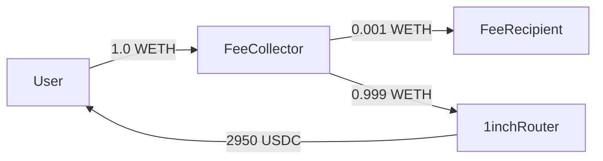

# TX Analyzer — Forensic Transaction Analysis

On-demand forensic analysis skill for investigating suspicious Ethereum transactions. Decodes calldata, traces fund flows, and identifies exploit patterns.

## When to use

- Investigating a suspicious `OrderExecuted` event flagged by P47 on-chain monitoring
- Analyzing a transaction after a P45 post-execution validation failure (critical severity)
- Tracing fund flows during an incident response (see `docs/Runbooks/executor-compromise.md`)
- Post-mortem analysis of a known exploit or anomalous swap

## How to invoke

```
/tx-analyzer 0x<transaction_hash>
```

Or in natural language:

> Analyze transaction 0xabc123... — check for fund flow anomalies

## What it does

1. **Fetches TX data** — receipt, internal traces, logs via RPC
2. **Decodes function calls** — matches selectors against TeraSwap ABIs and common DeFi protocol ABIs
3. **Maps fund flows** — every ERC-20 Transfer and ETH movement, with addresses labeled
4. **Identifies patterns** — flash loans, recursive calls, approval chains, price manipulation, unexpected recipients
5. **Generates a report** — structured markdown with summary, timeline, fund flow diagram, and risk assessment

## Prerequisites

- **Foundry (`cast`)** must be available in PATH — used for RPC calls and calldata decoding
- **RPC URL** — uses `$RPC_URL` env var, falls back to `https://eth.llamarpc.com`
- No external APIs, databases, or private keys required

## Analysis procedure

When this skill is invoked with a transaction hash, follow these steps in order:

### Step 1: Fetch transaction data

```bash
# Get the transaction
cast tx $TX_HASH --rpc-url $RPC_URL

# Get the receipt (logs, status, gas used)
cast receipt $TX_HASH --rpc-url $RPC_URL

# Get internal traces (call tree)
cast run $TX_HASH --rpc-url $RPC_URL 2>/dev/null || echo "Trace not available (requires archive node)"
```

If `cast` is not available, use direct RPC via curl:

```bash
# eth_getTransactionByHash
curl -s $RPC_URL -X POST -H "Content-Type: application/json" \
  -d "{\"jsonrpc\":\"2.0\",\"id\":1,\"method\":\"eth_getTransactionByHash\",\"params\":[\"$TX_HASH\"]}"

# eth_getTransactionReceipt
curl -s $RPC_URL -X POST -H "Content-Type: application/json" \
  -d "{\"jsonrpc\":\"2.0\",\"id\":1,\"method\":\"eth_getTransactionReceipt\",\"params\":[\"$TX_HASH\"]}"
```

### Step 2: Decode the transaction

1. **Identify the target contract** — check `to` against known addresses:
   - `0xeFC31ADb5d10c51Ac4383bB770E2fdC65780f130` = TeraSwapOrderExecutor
   - `0x4dAEAf24Cd300a3DBc0caff3292B7840CDDa58eD` = TeraSwapFeeCollector
   - Common DEX routers (1inch, Uniswap, etc.)

2. **Decode calldata** using the ABI files in `skills/tx-analyzer/abis/`:

```bash
# If target is OrderExecutor
cast calldata-decode "executeOrder((address,address,address,uint256,uint256,uint8,uint8,uint256,address,uint256,uint256,address,bytes32,uint256,uint256),bytes,bytes)" $CALLDATA

# Or decode the 4-byte selector first
cast sig $SELECTOR
```

3. **Decode all event logs** — match `topics[0]` against known event signatures. The common ones:
   - `0xddf252ad...` = ERC-20 `Transfer(address,address,uint256)`
   - `0x8c5be1e5...` = ERC-20 `Approval(address,address,uint256)`
   - See `abis/common-defi.json` for full list

### Step 3: Map fund flows

For every `Transfer` event in the receipt:
- Extract: `from`, `to`, `value`, `token contract address`
- Label known addresses (TeraSwap contracts, DEX routers, user wallets)
- Sum total inflows/outflows per address
- Flag any address receiving tokens that is NOT: the user, the contract, a known router, or the fee recipient

Generate a fund flow table:

| # | Token | From | To | Amount | Notes |
|---|-------|------|----|--------|-------|
| 1 | WETH | User | FeeCollector | 1.0 | Input |
| 2 | WETH | FeeCollector | FeeRecipient | 0.001 | Fee (0.1%) |
| 3 | WETH | FeeCollector | 1inch Router | 0.999 | Net to DEX |
| 4 | USDC | 1inch Pool | User | 2,950.00 | Output |

### Step 4: Identify anomalies

Check each of these patterns and flag if present:

**Critical anomalies:**
- **Unexpected recipient**: tokens sent to an address not in the signed order's `owner` field
- **Ownership transfer**: `OwnershipTransferred` or `AdminTransferred` event in the same TX
- **Executor change**: `ExecutorChangeProposed` / `ExecutorWhitelisted` event
- **Reentrancy**: same contract appears multiple times in the call trace at increasing depth

**Warning anomalies:**
- **Flash loan**: `FlashLoan` event or large borrow→repay in same TX (Aave, dYdX, Balancer)
- **Price manipulation**: Uniswap/Curve `Swap` events with extreme price impact (>10% implied slippage)
- **Approval chain**: multiple `Approval` events granting allowance to non-standard addresses
- **Self-destruct**: `SELFDESTRUCT` opcode in trace
- **Delegatecall to unknown**: `DELEGATECALL` to a contract not in the known-address list

**Info observations:**
- Multiple DEX hops (split routing — normal for aggregators)
- WETH wrap/unwrap operations
- Permit2 signature usage

### Step 5: Generate report

Output a structured report in this format:

```markdown
## Transaction Analysis: 0x<hash>

### Summary
- **Status:** Success / Reverted
- **Block:** #N (timestamp)
- **From:** 0x... (label if known)
- **To:** 0x... (label if known)
- **Value:** X ETH
- **Gas used:** X / X limit

### Function Called
- **Contract:** TeraSwapOrderExecutor
- **Function:** executeOrder(...)
- **Decoded args:** [list key parameters]

### Fund Flow
[Table from Step 3]

### Event Log
[Decoded events with human-readable names]

### Anomalies
- [List each anomaly found with severity]

### Risk Assessment
- **Overall risk:** Low / Medium / High / Critical
- **Recommendation:** [What to do next]
```

If generating a Mermaid fund flow diagram is helpful:



## Known addresses

These addresses should be labeled in the analysis output:

| Address | Label |
|---------|-------|
| `0xeFC31ADb5d10c51Ac4383bB770E2fdC65780f130` | TeraSwapOrderExecutor |
| `0x4dAEAf24Cd300a3DBc0caff3292B7840CDDa58eD` | TeraSwapFeeCollector |
| `0x107F6eB7C3866c9cEf5860952066e185e9383ABA` | Fee Recipient |
| `0x111111125421cA6dc452d289314280a0f8842A65` | 1inch v6 Router |
| `0xDef1C0ded9bec7F1a1670819833240f027b25EfF` | 0x Exchange Proxy |
| `0xDEF171Fe48CF0115B1d80b88dc8eAB59176FEe57` | ParaSwap Augustus v6 |
| `0xE592427A0AEce92De3Edee1F18E0157C05861564` | Uniswap V3 SwapRouter |
| `0x68b3465833fb72A70ecDF485E0e4C7bD8665Fc45` | Uniswap SwapRouter02 |
| `0xC02aaA39b223FE8D0A0e5C4F27eAD9083C756Cc2` | WETH |
| `0xA0b86991c6218b36c1d19D4a2e9Eb0cE3606eB48` | USDC |
| `0xdAC17F958D2ee523a2206206994597C13D831ec7` | USDT |
| `0x6B175474E89094C44Da98b954EedeAC495271d0F` | DAI |
| `0x000000000022D473030F116dDEE9F6B43aC78BA3` | Permit2 |
| `0x9008D19f58AAbD9eD0D60971565AA8510560ab41` | CoW Settlement |
| `0xC92E8bdf79f0507f65a392b0ab4667716BFE0110` | CoW VaultRelayer |

## Limitations

- **Archive node required** for internal traces (`cast run`). Public RPCs may not support `debug_traceTransaction`.
- **ABI coverage** is limited to TeraSwap contracts and common DeFi protocols. Unknown contracts will show raw calldata.
- **This is a forensic tool, not a real-time monitor.** For real-time detection, see P47 on-chain monitoring.
- **No automated remediation.** Analysis output informs human decisions. Follow the runbook for response actions.
