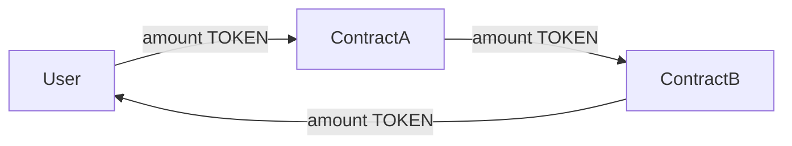

# Fund Flow Tracing

Trace the complete flow of funds through transaction `{{TX_HASH}}`.

## Purpose

This prompt focuses exclusively on Step 3 of the analysis procedure — mapping every token movement. Use this when you need a detailed fund flow analysis without the full forensic report.

## Procedure

### 1. Collect all transfer events

From the transaction receipt, extract every log that represents a token or ETH movement:

| Topic0 Hash | Event | What to extract |
|-------------|-------|-----------------|
| `0xddf252ad1be2c89b69c2b068fc378daa952ba7f163c4a11628f55a4df523b3ef` | ERC-20 `Transfer` | from (topic1), to (topic2), value (data), token (log address) |
| `0xe1fffcc4923d04b559f4d29a8bfc6cda04eb5b0d3c460751c2402c5c5cc9109c` | WETH `Deposit` | dst (topic1), wad (data) |
| `0x7fcf532c15f0a6db0bd6d0e038bea71d30d808c7d98cb3bf7268a95bf5081b65` | WETH `Withdrawal` | src (topic1), wad (data) |

Also account for:
- `tx.value` (ETH sent with the transaction)
- Internal ETH transfers (from trace data, if available)

### 2. Resolve token metadata

For each unique token contract address found in Transfer events:

```bash
# Get symbol and decimals for human-readable amounts
cast call $TOKEN_ADDRESS "symbol()(string)" --rpc-url $RPC_URL
cast call $TOKEN_ADDRESS "decimals()(uint8)" --rpc-url $RPC_URL
```

Use the known addresses table to label common tokens:
- `0xC02aaA39b223FE8D0A0e5C4F27eAD9083C756Cc2` = WETH (18 decimals)
- `0xA0b86991c6218b36c1d19D4a2e9Eb0cE3606eB48` = USDC (6 decimals)
- `0xdAC17F958D2ee523a2206206994597C13D831ec7` = USDT (6 decimals)
- `0x6B175474E89094C44Da98b954EedeAC495271d0F` = DAI (18 decimals)

### 3. Label all addresses

For each unique address in the fund flow, assign a label:

1. Check against known addresses in SKILL.md
2. Check if it matches the transaction `from` or `to` field (label as "TX Sender" / "TX Target")
3. For unlabeled addresses, check if they appear as the `address` field of a Swap event (likely a pool)
4. Remaining unknown addresses: label as `Unknown (0x...first6)`

### 4. Build the flow table

Order by log index (chronological within the transaction):

```markdown
| # | Token | From | To | Amount | Notes |
|---|-------|------|----|--------|-------|
```

**Amount formatting:**
- Use human-readable amounts (divide by 10^decimals)
- Show 4 significant digits for large amounts, full precision for small
- Append the token symbol

**Notes column — tag each transfer:**
- `Input` — tokens entering the system from the user
- `Fee` — fee deduction (to FeeRecipient or within FeeCollector)
- `Router hop` — intermediate transfer between DEX contracts
- `Pool swap` — transfer from/to a liquidity pool
- `Output` — tokens returning to the user
- `Unknown` — transfer to/from an unidentified address (flag for review)

### 5. Calculate net flows

Summarize per-address:

```markdown
### Net Position
| Address | Label | Token | In | Out | Net |
|---------|-------|-------|----|-----|-----|
```

### 6. Generate Mermaid diagram



Rules:
- Use labels, not raw addresses
- Include amounts on every edge
- Color-code: green for user output, red for fees, gray for intermediate hops
- If more than 8 nodes, group intermediate DEX hops into a single "DEX Routing" node

### 7. Verify conservation

Check that tokens are conserved (no tokens created from nothing or lost):
- For each token: sum of all `from` transfers should equal sum of all `to` transfers
- Exception: WETH Deposit/Withdrawal converts between ETH and WETH (net zero across both)
- Exception: Fee-on-transfer tokens may show slight imbalance

If conservation fails, flag it explicitly — this may indicate a missing internal transfer (trace needed) or a token with non-standard transfer behavior.

## Output

Return:
1. The fund flow table
2. Net position summary
3. Mermaid diagram
4. Conservation check result
5. Any flagged anomalies (unexpected recipients, unusually large fees, tokens sent to unknown addresses)
